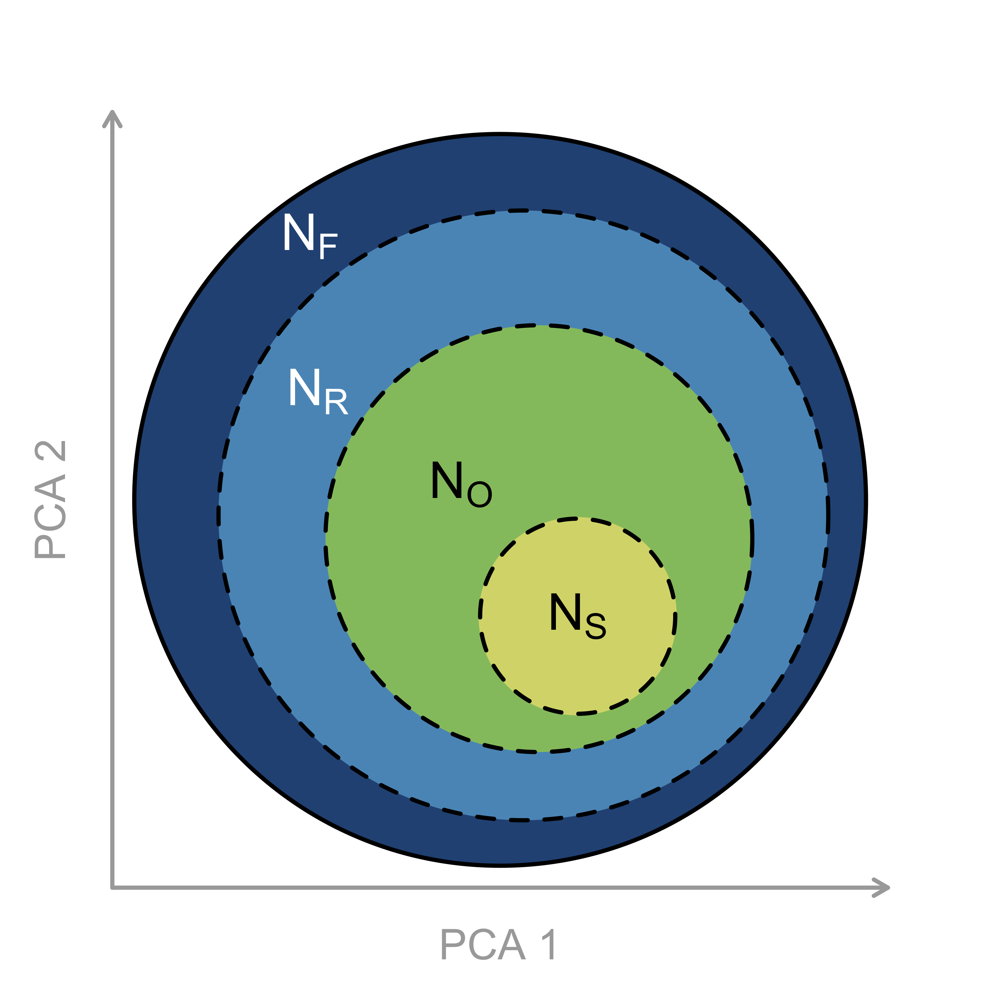

# Niche characterisation is biased by limited and heterogeneous spatial sampling

Author(s): [Lewis A. Jones](mailto:LewisA.Jones@outlook.com), [Alfio Alessandro Chiarenza](mailto:a.chiarenza15@gmail.com), [Erin Saupe](erin.saupe@earth.ox.ac.uk), [Alexander Farnsworth](alex.Farnsworth@bristol.ac.uk), [Paul Valdes](P.J.Valdes@bristol.ac.uk) and [Sara Varela](sara.varela@uvigo.es).

This repository contains the data and code required to run the analyses and results of the article, "Niche characterisation is biased by limited and heterogeneous spatial sampling" (Jones et al., XXXX). 

To cite the paper: 
> Jones, L.A., Chiarenza, A.A., Saupe, E., Farnsworth, A., Valdes, P., Varela, S. XXXX. Niche characterisation is biased by limited and heterogeneous spatial sampling. (TBC).

To cite this repository:
> XXXX

-------
## Data
All data used to run the analyses of this paper are included in this repository.

* `data/` contains two subfolders `data/climate/` and `data/raw-data/`.
* `data/raw-data/` contains the raw climate data used in this work.
* `data/climate/` contains the processed climate model data which has been rotated from 0&deg; to 360&deg; to -180&deg; to 180&deg; and downscaled to a horizontal resolution of 1&deg; x 1&deg;. This is the data used for the virtual species simulations.

-------
## Data preparation and analyses
All data prepration and analyses were conducted in R. Relevant scripts can be found in the `R/` folder. Within this folder, you will find a `run-analyses.R` and `options.R` file for running the analyses and defining different settings.

* `R/subscripts/` this folder contains the scripts for running data preparation and analyses.
* `R/functions/` this folder contains function scripts which are called for some elements of the analyses.
* `R/figures/` this folder contains the scripts for generating figures and tables presented in the manuscript.

-------
## Results
All results can be found in the `results/` folder. These are structured as follows:

* `R/virtual-species/` this folder contains all the virtual species data which were simulated in this study. 
* `R/sampling-window/` this folder contains rasters and dataframes for the stage-level spatial sampling windows used to filter virtual species' distributions.
* `R/ecospat/` this folder contains the results from ecospat analyses (i.e. niche unfilling and centroid distance results). * `R/dismo/` this folder contains the results from ecological niche modelling geographic comparisons (i.e. binary overlap results).

-------
## Figures
All figures can be found in the `figures/` folder. To see the code to reproduce these figures, check `R/figures/`.

 
